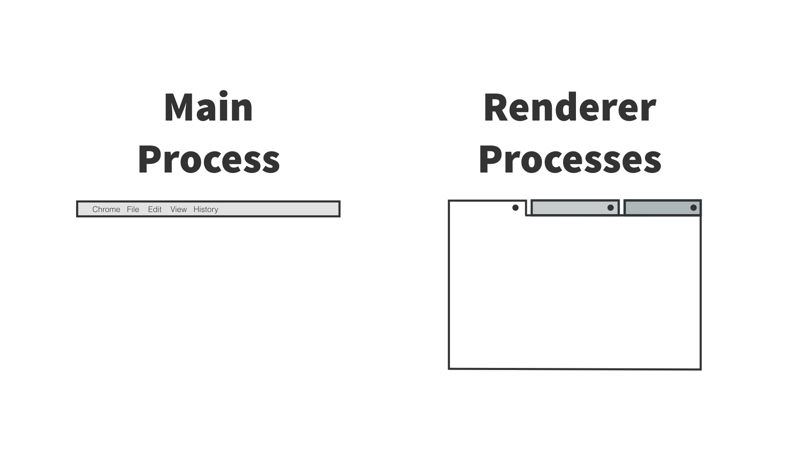

footer: @fraserxu
slidenumbers: true

# [fit] Mad Science With Electron

---

# About me


@fraserxu
JavaScript Developer @Envato

---

# What is Electron?

> Build cross platform desktop apps with JavaScript, HTML, and CSS
-- https://electron.atom.io/

---

# Apps Build With Electron

* Slack
* Atom
* Visual Studio Code
* WebTorrent
* Hyper

---

# Concept


---



---

## Main Process

> In Electron, the process that runs `package.json`’s main script is called the `main process`. The script that runs in the main process can display a GUI by creating web pages.

* Create renderer process
* Call native elements
* Start and quite app

---

## Renderer Process

> Since Electron uses Chromium for displaying web pages, Chromium’s multi-process architecture is also used. Each web page in Electron runs in its own process, which is called the `renderer process`.

* Design your page with HTML & CSS
* JavaScript page interactions

---

## Application structure


```
mad-science-with-electron-campjs/
├── package.json
├── main.js
└── index.html
```

---

#### An example of your package.json might look like this:

```JSON
{
  "name": "mad-science-with-electron-campjs",
  "version": "0.1.0",
  "main": "main.js"
}
```

---

## Import depedencies

```javascript
const { app, BrowserWindow } = require('electron')
```

---

### Create Window when Application ready

```javascript
const { app, BrowserWindow } = require('electron')

let win

app.on('ready', () => {
  createWindow()
})

```

---

## Open Window

```javascript
let win

function createWindow () {
  win = new BrowserWindow({ width: 800, height: 600 })

  win.loadURL(
    url.format({
      pathname: path.join(__dirname, 'index.html'),
      protocol: 'file:',
      slashes: true
    })
  )
}
```

---

## Create UI

```html
<!DOCTYPE html>
<html>
<head>
  <meta charset="UTF-8">
  <title>Hello CampJS!</title>
</head>
<body>
  <h1>Hello CampJS!</h1>
</body>
</html>
```

---

# Demo

---

# [fit] Let's build something useful

---


---

# UI

```HTML
<main>
  <input id="input" type="text" autofocus placeholder="Paste youtube url here" />
  <button id="download">Download</button>
  <div id="status">
    <div>
</main>
```

---

## Hook up with click event

```js
const downloadButton = document.getElementById('download')
const urlInput = document.getElementById('input')

downloadButton.addEventListener('click', startDownload)
const startDownload = () => {
  const youtubeUrl = urlInput.value
  if (!youtubeUrl) return
  console.log(`downloading from ${youtubeUrl}`)
}
```

---

## [fit] How do we download videos from Youtube? 🤔

---

> youtube-dl is a command-line program to download videos from YouTube.com and a few more sites. It requires the Python interpreter (2.6, 2.7, or 3.2+), and it is not platform specific.

[youtube-dl](https://rg3.github.io/youtube-dl/)

---

## Spawn Child Process with Node.js

```js
const { spawn } = require('child_process')
const ls = spawn('ls', ['-lh', '/usr'])

ls.stdout.on('data', (data) => {
  console.log(`stdout: ${data}`)
})

ls.stderr.on('data', (data) => {
  console.log(`stderr: ${data}`)
})

ls.on('close', (code) => {
  console.log(`child process exited with code ${code}`)
})
```

---

# [fit] But `youtube-dl` is not cross platform 😕

---

## Golang

```go
package main

import "fmt"

func main() {
  fmt.Printf("Hello\n")
}
```

---

### Compile

```
go build main.go
```

### Cross Compile

```
$ GOOS=windows GOARCH=386 go build -o hello.exe hello.go
```

---

# [fit] What if there's a Golang alternative for youtube-dl?

---


## Download a youtube video with ytdl

```js
const { spawn } = require('child_process')

let ytdlPath = path.join(__dirname, './bin/ytdl')
if (process.platform === 'win32') {
  ytdlPath += '.exe'
}

const desktopPath = app.getPath('desktop')
const dl = spawn(ytdlPath, [
  '--no-progress',
  '-o',
  `${desktopPath}/{{.Title}}.{{.Ext}}`,
  arg
])
```

---

```js
let ytdlPath = path.join(__dirname, './bin/ytdl')
if (process.platform === 'win32') {
  ytdlPath += '.exe'
}
```

---


### [fit] Communication between two processes

---


---

## Main process

```js
const ipc = require('electron').ipcMain

ipc.on('asynchronous-message', function (event, arg) {
  event.sender.send('asynchronous-reply', 'pong')
})
```

---

## Renderer process

```js
const ipc = require('electron').ipcRenderer

ipc.on('asynchronous-reply', function (event, arg) {
  const message = `Asynchronous message reply: ${arg}`
  console.log('Reply message', message)
})
```

---

### Hook `ytdl` messages with `stdout` and `stderr`

---

Main process

```js
ipcMain.on('start-download', (event, arg) => {
  const desktopPath = app.getPath('desktop')
  const dl = spawn(ytdlPath, [
    '--no-progress',
    '-o',
    `${desktopPath}/{{.Title}}.{{.Ext}}`,
    arg
  ])

  dl.stdout.on('data', data => {
    event.sender.send('download-status', formatMsg(data.toString()))
  })

  dl.stderr.on('data', data => {
    console.log(`stderr: ${data}`)
  })

  dl.on('close', code => {
    event.sender.send(
      'download-status',
      '[electron youtube-dl] Finished download'
    )
  })
})
```

---

Renderer process

```js
const ipc = require('electron').ipcRenderer

ipc.on('download-status', (event, arg) => {
  console.log('Download status:', arg)
})
```

---

Show message in the UI

```js
ipc.on('download-status', (event, arg) => {
  const msgElement = document.createElement('span')
  msgElement.innerText = arg
  const brElement = document.createElement('br')
  statusBar.prepend(brElement)
  statusBar.prepend(msgElement)
})
```

---

## Demo

---

## No Demo :(

---


---

## [fit] Writting Command line tools with Electron

---

```sh
$ electron --help
Electron 1.6.11 - Build cross platform desktop apps with JavaScript, HTML, and CSS

  Usage: electron [options] [path]

  A path to an Electron app may be specified. The path must be one of the following:

    - index.js file.
    - Folder containing a package.json file.
    - Folder containing an index.js file.
    - .html/.htm file.
    - http://, https://, or file:// URL.

  Options:
    -h, --help            Print this usage message.
    -i, --interactive     Open a REPL to the main process.
    -r, --require         Module to preload (option can be repeated)
    -v, --version         Print the version.
    --abi                 Print the application binary interface.
```

---

### Parse command line argument options

```js
const minimist = require('minimist')
const argv = minimist(process.argv.slice(2))
console.log({ argv })
```

```sh
$ node ./bin/cmd.js --input=https://fraserxu.me --output=fraserxu.pdf
$ { argv: { _: [], input: 'https://fraserxu.me', output: 'fraserxu.pdf' } }
```

---

### Prepare boilerplate to launch electron from CLI

```js
#!/usr/bin/env node

const spawn = require('child_process').spawn
const electronPath = require('electron')
const path = require('path')

const generatorPath = path.resolve(__dirname, '../pdf.js')

let args = process.argv.slice(2)
args.unshift(generatorPath)

const cp = spawn(electronPath, args, {
  //       stdin,     stdout,    stderr
  stdio: ['inherit', 'inherit', 'pipe', 'ipc']
})

```

---

### And then we can creat our pdf generator

```js
const fs = require('fs')
const path = require('path')
const minimist = require('minimist')
const { app, BrowserWindow, shell } = require('electron')

const argv = minimist(process.argv.slice(2))

const {
  input,
  output
} = argv

let win

app.on('ready', createWindow)

```

---

```js
const createWindow = () => {
  win = new BrowserWindow({
    show: false
  })

  win.loadURL(input)

  // https://electron.atom.io/docs/api/web-contents/
  let contents = win.webContents

  const desktopPath = app.getPath('desktop')
  const pdfPath = path.join(desktopPath, output)
  contents.on('did-finish-load', () => {
    contents.printToPDF({
      printBackground: true
    }, (err, data) => {
      if (err) throw err
      fs.writeFile(pdfPath, data, err => {
        if (err) throw err
        console.log('success write file to ', pdfPath)
        shell.openExternal('file://' + pdfPath)
        process.exit(0)
      })
    })
  })
}
```

---

# Demo

---

## Result

```
$ node ./bin/cmd.js --input=http://viii.campjs.com/ --output=viii.campjs.com.pdf
success write file to  /Users/fraserxu/Desktop/viii.campjs.com.pdf
```

---

## electron-pdf

> A command line tool to generate PDF from URL, HTML or Markdown files.
-- https://github.com/fraserxu/electron-pdf

---


### Running Headless JavaScript Test

```js
process.stdin
  .pipe(runner)
  .on('results', results {
    process.exit(Number(!results.ok))
  })
```

---

### Links

* [Running Headless JavaScript Testing with Electron On Any CI Server](https://webuild.envato.com/blog/running-headless-javascript-testing-with-electron-on-any-ci-server/)
* [tape-run](https://github.com/juliangruber/tape-run)
* [electron-mocha](https://github.com/jprichardson/electron-mocha)

---

# [fit] "Abusing" the Browser API and Create Mad Science

---

## electron-speech

> Speech recognition in node and the browser using Electron.
-- https://github.com/noffle/electron-speech

```js
if ('webkitSpeechRecognition' in window) {
  var recognition = new webkitSpeechRecognition()
  recognition.continuous = true
  recognition.interimResults = true

  recognition.onstart = function() { /* */ }
  recognition.onresult = function(event) { /* */ }
  recognition.onerror = function(event) { /* */ }
  recognition.onend = function() { /* */ }
}
```

---

## hypervision

> hypervision is a desktop application that lets you both watch and broadcast p2p live streams.
-- https://github.com/mafintosh/hypervision

* electron
* getusermedia
* hypercore
* hyperdiscovery

---

## Related

* [nilejs.com](nilejs.com) - Scalable peer-to-peer live video streaming

---

# Links

Quick Start

* https://electron.atom.io/docs/tutorial/quick-start/
* https://github.com/electron/electron-api-demos

---


---

# [fit] Thanks
